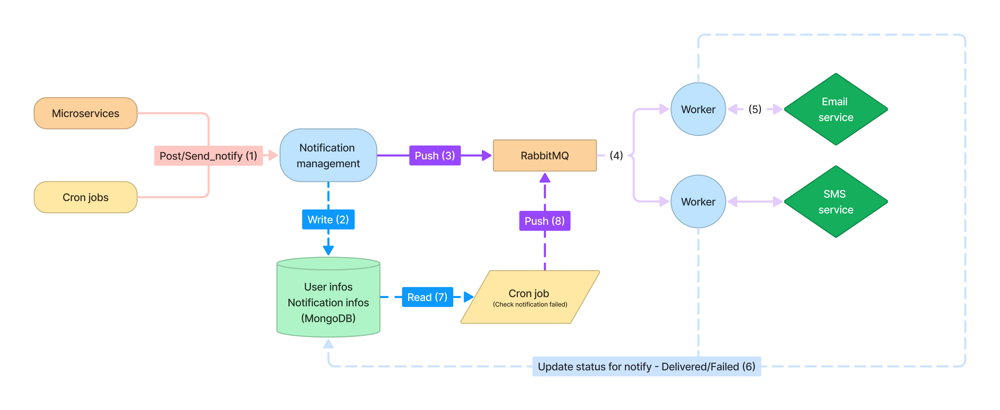

<p align="center">
  
</p>
<h2 align="center">Notification system</h2>

### Description

In our system, <a href="https://www.rabbitmq.com/">RabbitMQ</a> takes center stage as a core element, facilitating the streamlined distribution of notifications to email and app endpoints. This is achieved through a dynamic interplay between push and pull processors, each playing a vital role in ensuring efficient communication.

Developers can harness the power of job scheduling within our framework, enabling them to set up campaigns or work reminders with ease. This feature enhances the flexibility of our system, allowing for targeted and timely notifications.

One of the standout features of our architecture is its resilience. In cases where a push notification encounters a setback, developers need not worry. Our system automatically takes charge, initiating a retry mechanism for failed notifications. This ensures that missed notifications get a second chance, bolstering the overall reliability of our notification infrastructure.

### System design
<br/>
<p align="center">
  
</p>

1. Received `Post request`
2. It will check all users corresponding to the message and create a notification with the status set to `Pending`. For each user, a notify record will be generated.
3. The system will push the newly created messages to `RabbitMQ`.
4. `RabbitMQ` will queue the messages and navigate them to the corresponding workers, preventing server overload.
5. The designated `Worker` processes will push notifications to the appropriate services. These services are responsible for sending emails, SMS, and other notifications.
6. The notifications are sent, the `Worker` will receive notification statuses such as `Delivered` or `Failed`, and these statuses will be updated in the database.
7. A `Cron job` will periodically check for notifications that failed to send.
8. Notifications that failed will be pushed to `RabbitMQ` again.

### Installation

```bash
$ yarn install
```

## Running the app

```bash
# development
$ yarn run start

# watch mode
$ yarn run start:dev

# production mode
$ yarn run start:prod
```

## Test

```bash
# unit tests
$ yarn run test

# e2e tests
$ yarn run test:e2e

# test coverage
$ yarn run test:cov
```

## Support

Nest is an MIT-licensed open source project. It can grow thanks to the sponsors and support by the amazing backers. If you'd like to join them, please [read more here](https://docs.nestjs.com/support).

## Stay in touch

- Author - [Kamil Myśliwiec](https://kamilmysliwiec.com)
- Website - [https://nestjs.com](https://nestjs.com/)
- Twitter - [@nestframework](https://twitter.com/nestframework)

## License

Nest is [MIT licensed](LICENSE).
